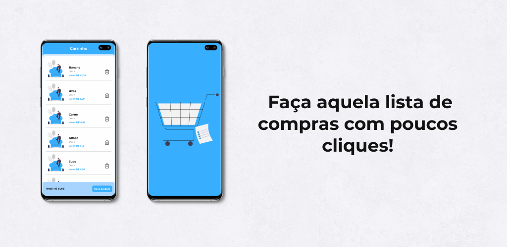

# Marketplace List

Esse simples App de lista de compras tem como objetivo ser simples e eficiente. A ideia é que você consiga criar a sua lista de compras e já saiba o valor final da compra.

## Recursos utilizados

- Arquitetura MVVM
- Navigation Component
- Dagger Hilt
- Room
- Firebase para monitoramento de falhas

## Processo de criação

Mostrarei alguns meios que me ajudaram a ter a ideia e desenvolver esse app.

## Design e idealização:

- Utilizei o Dribbble e alguns rabiscos para pensar e idealizar a estrutura.

- Utilizei o Figma para a construção do layout e do protótipo do App.

## **Autor - Lucas Alvarenga**

- Meu Portfólio: [https://www.alvarenga.dev/](https://www.alvarenga.dev/)
- Instagram: [@Alvarenga.dev](https://www.instagram.com/alvarenga.dev/)
- Github: [@Alvarenga-Dev](https://github.com/Alvarenga-Dev)
